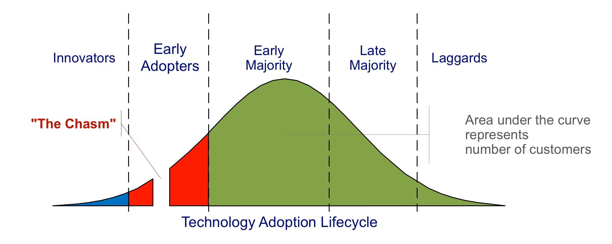
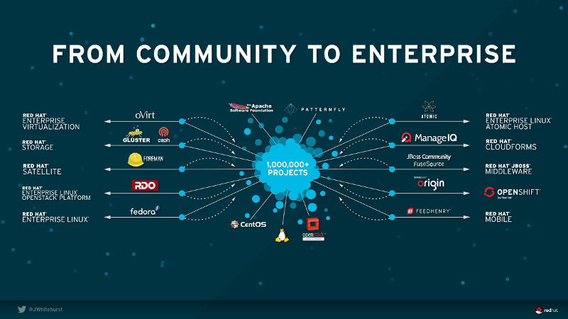
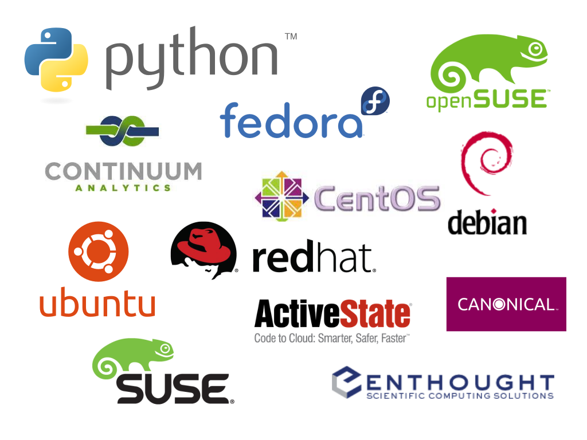
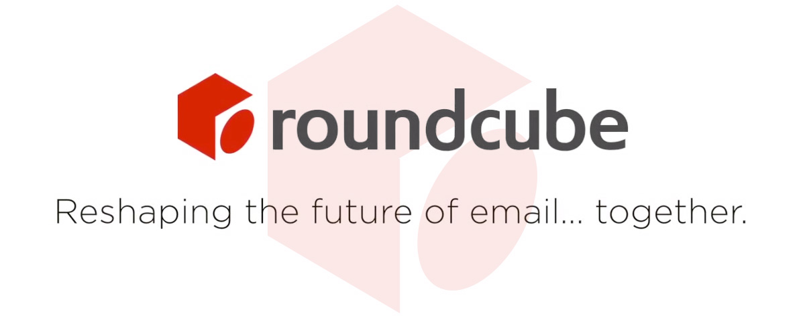

# Contributors, colleagues, clients & customers

---

# Your time is valuable...

# Presenter Notes

* If you take nothing else away from my talk, take this
* Life is filled with people who won't respect your time
* The internet empowers us to find people who will

---

# ...and so is that of everyone else

# Presenter Notes

* For folks that thought "Of course my time is valuable" when you saw the first
  slide, this slide's for you
* busy, stressed -> forget others are also busy & stressed
* This slide is for me, too, since arrogance comes fairly easily to me
* short step from there to disrespecting other people's time

---

# Sustainability matters

# Presenter Notes

* The generosity of spirit in the open source community is phenomenal
* bad if it's at the expense of people's health, their
  personal relationships, or their work commitments
* We need to care about how our benefactors are sustaining themselves and
  (in many cases) their dependents
* We need sustainable open source development to be the norm, not the
  exception

---

# "Nobody" pays for open source software

# Presenter Notes

* I hear this lament a lot
* And then I look at what I do for a living
* And I revise what I heard

---

# "Nobody (I care about)" pays for open source software

# Presenter Notes

* Other than games, I have a hard time bringing myself to pay for useful
  software that isn't included as part of a piece of hardware
* Scientists & educators, the folks I most care about helping, often have no
  budget to pay for software
* Many of my open source peers seem to be the same way - the folks we most want
  to help & empower have more important things to be spending money on than
  software
* That means if we care about the sustainability of open source development, we
  have to get a little more creative

---

# Software is a means, not an end

# Presenter Notes

* Something we can easily lose sight of as technologists is that technology
  ultimately doesn't matter
* What matters is people, and the way we can bring technology to bear to better
  address their needs, and to allow more people the opportunity to achieve their
  goals and ambitions
* But in a networked world, software is an essential facilitator and enabler in
  connecting people, and that software requires maintenance

---

# Be charitably mercenary

# Presenter Notes

* Tim O'Reilly on doing business in a networked world: "create more value than
  you capture"
* My mental follow-up: "capture enough value to thrive"
* Educators, scientists, the public service & non-profits often poorly served
* open source means we can help these communities help themselves
* we need to eat, we need somewhere to live, and we want to avoid being
  permanently beholden to the whims of our current employer
* So we do the job, and then we get paid

---

# Scarcity in the age of open source

# Presenter Notes

* Aiming to get paid is all well and good, but marginal cost of software is
  effectively zero
* A fundamental precept of business is to charge for scarce resources
* Software is now abundant
* Time and money wasted coercively enforcing artificial scarcity
* Bundling with hardware works, but poses very high barriers to entry

---

# Supply and demand

# Presenter Notes

* We need a different answer, one that doesn't require the huge up front
  investments involved in getting into the hardware industry
* Business development 101
* Expansive future demand
* Naturally limited supply

---

# Finding the opportunity

# Presenter Notes

* Software business models were originally built on paying for upgrades
* Upgrades used to involve printing & shipping physical media
* The business model aligned with the marginal cost of delivery
* The internet changed all that, and broke the analogy powering the
  "pay for upgrades" model
* Revising our hardware/software analogies is a fruitful endeavour

---

# Software decays over time

# Presenter Notes

* Hardware allows you to charge for both new devices and maintaining existing
  ones
* Hardware maintenance is both reactive *and* preventative
* We intuitively understand that hardware decays if left unmaintained
* Software decay is less intuitive, but still real
* Hardware changes, operating systems change, regulations change, development
  techniques change, social norms change, user expectations change
* The world doesn't stand still, and we have to run to keep up

---

# Sustaining engineering

# Presenter Notes

* Once we've deployed a piece of software to serve a particular purpose, we want
  that software to keep serving that purpose
* "Will this work today?" -> free-as-in-beer open source
* "Will this still work tomorrow? Next week? Next year? Next decade?" -> Folks
  that have the luxury of asking these questions are generally willing to pay
  for good answers
* Potential opportunity: sustaining engineering for mission critical systems

---

# 

# Presenter Notes

* Welcome to the green part of the technology adoption curve - the place where
  successful open source vendors go to make their money
* this pattern recurs over and over, in industry after industry, for innovation
  after innovation
* [describe chart - innovators, the chasm, etc]
* experts want to be on the cutting edge, looking for new ideas, trying out
  new approaches, and dropping them just as fast if they turn out not to work
* But outside our areas of expertise? We're more likely to want something that
  "just works"

---

# Finding our supply constraint

# Presenter Notes

* An opportunity only becomes a business if you can figure out a revenue model
* You want an assential capability that you deliver better than anyone else

---

# Contributor time is naturally scarce

# Presenter Notes

* Thanks to open source, new software is now cheap
* Thanks to the public cloud, deploying a new application is now easy
* Apparently less than 30 million professional developers worldwide
  (http://www.infoq.com/news/2014/01/IDC-software-developers)
* We're not the 1%, we're the 0.05%
* Therefore: the care and feeding of existing software remains expensive
* And this brings us back to the point on the first slide: your time is
  valuable.

---

# Models for open source sustaining engineering

# Presenter Notes

* So we have a potential opportunity and a natural scarcity
* Let's look at the approaches folks currently take to solving this problem

---

# Magic internet pixies

# Presenter Notes

* Open source is often deployed without a sustaining engineering plan
* I call this the "magic internet pixies" model
* Assumes pixies will handle changes in technology and regulations
* New feature development is fun -> lots of folks will do it for free
* Sustaining engineering is relatively dull, so folks need to be paid
* As the Linux Foundation's Core Infrastructure Initiative shows, even
  orgs that should know better can still make this mistake

---

# Self-support

# Presenter Notes

* Significant step up from the magic internet pixie model
* Staff time is allocated to engaging directly with open source communities
* includes hiring existing contributors for key dependencies
* staff as volunteers -> still magic internet pixies
* For big enough organisations, this model can work really well
* For smaller organisations -> single points of organisational failure
* Also constrains the number of communities you can engage with effectively

---

# Commercial open source redistributors

# Presenter Notes

* Orgs depending on open source have a need for sustaining engineering
* Lack of expertise and lack of scale limit capacity for self-support
* That opportunity -> commercial open source redistributors
* Essentially "community engagement as a service"
* single place to obtain software, report problems, and suggest improvements
* benefit from hundreds or thousands of different open source projects
* Software delivered as online services or as software subscriptions

---

# Avoiding digital sharecropping

# Presenter Notes

* There's a moral hazard here though - as a commercial open source
  redistributor, you're making money from the freely shared work of others
* If you're not careful, this can easily cross the line into unfairly
  exploiting the community
* Fortunately, there are some relatively straightforward steps redistributors
  can take to help ensure they're engaging collaboratively with upstream
  communities rather than merely exploiting them for free labour

---

# Reciprocity is essential

# Presenter Notes

* First and foremost is playing by the same rules your contributors play by
* Red flag for deliberate community exploitation is when an org is happy to
  accept and profit from the work of others, but refuses to grant that same
  opportunity in relation to their own work
* The simplest possible approach to dealing with this is to say that the
  upstream community gets access to all of the software they helped to write
* Trademark law still provides opportunities to differentiate your commercial
  products from your community projects

---

# Your deadlines are your problem

# Presenter Notes

* Software development in the presence of deadlines often involves technical
  compromises
* Most communities aren't going to care about your deadline and are likely to
  reject compromises
* Must design in the ability to diverge from upstream temporarily
* Allows you to solve problems in a hurry when you have to, and then resolve
  the upstream discussion at a more relaxed pace
* The delta also nicely quantifies how much technical debt you're carrying

---

# No obligation without compensation

# Presenter Notes

* Two of the essential things that I believe should always be paid for are
  availability and responsiveness
* Open source in general has a problem where we'll not only allow, but actively
  encourage, folks to volunteer for these kinds of high time commitment roles
* It's a fast path to burnout, and it's an area where downstream redistributors
  and folks running self-supported open source have a significant role to play
* Either through direct funding, or indirect funding via trade associations
  and charitable foundations

---

# Respecting people's time

# Presenter Notes

* If you're not paying, folks contribute because *they* find it rewarding
* vendor's and commercial user's business needs comes a long way down
  the priority list for most community contributors
* If a vendor or end user wants something particular, they need to be prepared to
  commit to providing the time and energy needed to make it happen, and also to
  work collaboratively to seek the wider community's agreement on a particular
  course of action before proceeding with it

---

# Putting the pieces together

# Presenter Notes

* Established there's a demand for a consistent approach to
  sustaining engineering across a wide range of open source projects
* Established that contributor time is a scarce resource we can
  charge for access to
* We've identified some key missteps that lead to crossing the line into
  exploiting upstream communities rather than collaborating with them

---

# 

# Presenter Notes

* Which finally brings us to the title of this talk
* Contributors, colleagues, clients, and customers - four very
  different ways of directly or indirectly engaging with an open
  source community
* Different folks care about different things, and have varying amounts of
  time to devote to particular areas

---

# Contributors: Changing the world (as a hobby)

# Presenter Notes

* The key distinction I make between contributors and colleagues in
  open source, is that contributors are offered the opportunity to have
  an impact, but have no specific responsibilities
* Projects have the authority to decline to accept attempted contributions,
  and to define the criteria for inclusion, but whether or not the pay-off
  in personal experience and impact on the project for meeting those criteria
  is worth the time invested is a question left to each individual contributor
* Students, academics, established industry professionals, retirees, and folks
  that simply enjoy tinkering with code are great candidates for getting
  involved in open source as volunteer contributors

---

# Not their circus, not their monkeys

# Presenter Notes

* "Not my circus, not my monkeys" is a wonderful Polish saying for disclaiming
  responsibility for resolving a problem
* When asking contributors to spend time on something, it's essential to
  remember the principle of "no obligation without compensation"
* The only real obligation for individual contributors is to respect community
  codes of conduct - when we don't want to do that, we have the entire rest of
  the internet to play in

---

# Colleagues: Changing the world (as a job)

# Presenter Notes

* Once folks accumulate responsibilities in a community, the time commitments
  start to grow, and sustainability requires finding ways to get paid for the
  work
* Important to care about the sustainability of our peers' community
  involvement, and support folks in managing their stress levels
* Colleagues in this sense may not be employees of the same company - they may
  work for trade associations, non-profit foundations, competing
  redistributors, companies that are running self-supported instances
  of the project, consulting companies that rely on the project, and more

---

# Free time is not equitably distributed

# Presenter Notes

* Involvement in open source communities builds on the three pillars of
  interest, ability, and time
* A lot of organisations are starting to build hiring pipelines that rely on
  seeing open source contributions prior to extending an employment offer
* While this does make it possible to gauge interest and ability prior to
  hiring, it's problematic when it comes to the third pillar - hiring pipelines
  that work this way will inevitably reflect broader social biases in the
  relative amount of free time available to different groups

---

# Outreachy Model View Culture

# Presenter Notes

* This is a serious problem, so I want to highlight a couple of specific
  organisations that are doing important work in this area
* Outreachy (Software Conservancy) offers paid scholarships for folks from
  underrepresented groups to spend time working on open source projects
* Model View Culture (from Model View Media) represents a media organisation
  doing its job properly in holding up a critical mirror to our industry
  rather than the more traditional fare that resembles gossip magazines
  starring tech and business leaders

---

# Clients: Solving specific problems

# Presenter Notes

* To make money, the question is not "what do you want to build?"
* Rather: Whose problems are you planning to solve? Why should the trust you?
* Most obvious form: open source based software consulting businesses
* A second form: organisations running self-supported open source software
* A third form: philanthropic grants

---

# Customers: Meeting a common need

# Presenter Notes

* Funding based on specific clients or benefactors can work well at
  a smaller scale, but struggles to create the kind of recurring funding
  stream needed to sustainably commit hundreds or thousands of people to
  working on open source community contributions
* This is where the green section of the technology adoption curve comes in:
  users looking for solutions that solve their problems at a price they're
  willing to pay
* Key business development task is figuring out what folks are ready, willing
  and able to pay for that you're prepared to invest time and money in
  delivering

---

# How do we know this works?

# Presenter Notes

* That's all very nice and hand-wavey, but how well does it actually
  work?
* Two key aspects to consider

---

# Commercial relationships

# Presenter Notes

* On the client and customer facing side, the main difference between open
  source and other software development models is that you get an extra
  "no lock-in" selling point
* Beyond that, you live and die the same way any other software company
  does - on the quality of your engineering, your product management, your
  customer support, your documentation, your training offerings, your partner
  ecosystem, your strategic gameplay, and so on and so forth.
* There are a lot of ways to fail here, but they have little to do with
  products being based on open source projects, and everything to do with
  building and running a business being a genuinely hard problem

---

# Community relationships

# Presenter Notes

* On the community facing side, it's a very, very rare company that will
  actively try to engage their community in the governance process. As a result,
  most companies that publish open source software gain only a tiny fraction of
  the potential benefits available by engaging in good faith with industry
  peers, academic researchers, hobbyists, students, and more.
* Unfortunately, the open source industry is still young enough that we're
  short on good scientific studies, so I'm unfortunately going to have to address this
  question with some examples of personal relevance, rather than the results of
  rigorous data analysis.

---

# 

# Presenter Notes

* Boeing Defence Australia -> Red Hat Asia-Pacific -> RHEL Developer Experience
* This is a slide from Jim Whitehurst's keynote at Red Hat Summit this year
* sprawling community -> community integration projects
  -> opinionated commercial products
* Denise Dumas, VP heading up RHEL engineering, presented at Fedora's Flock
  conference on the company's current areas of active interest
* personal perspective as a frontline open source developer for a large open
  source redistributor
* consistent not just with what we hear Red Hat's leadership say, but also with
  what we see them *do*

---

# 

# Presenter Notes

* CPython core developer for around a decade
* Slide shows some of major community and commercial redistributors
  of CPython
* Not shown: Python using orgs, Python consulting shops, in-house
  development & data analysis
* sustainably creating and giving away open source software is a pretty
  amazing goal, and being able to be part of that process is an astonishingly
  rewarding experience

---

# 

# Presenter Notes

* A company and project that I think are currently doing this right are
  Roundcube, who produce a popular open source webmail interface
* With Kolab Systems, crowdfunded investment in a major user experience update
* campaign was well designed to allow major client organisations to
  self-identify by choosing the highest $10k backer tier, while still giving
  potential contributors and customers plenty of opportunity to participate
* Will watch how this evolves as cloud hosted platform as a service offerings
  evolve

---

# Making it personal

# Presenter Notes

* Different folks have different reasons for wanting to be involved in open
  source development
* I can't honestly speak to anyone else's motives, but I can speak to my own
  reasons for wanting to work in this kind of environment, and to help more
  folks succeed in doing so profitably and sustainably

---

# Return on time invested (industry default)

# Presenter Notes

* Standard practice in our industry is still to take the work of software
  developers, designers and technical writers, and lock it away, to be made
  available only in return for payment
* Even when some aspects of the software are made generally available, it's
  often only in a crippled form, or in a form where the provider can still
  exert complete and total control over the UX
* These approaches massively reduce the potential reach of my work, and also tie
  access to my own previous work to employment with a particular organisation
* value investor for longer than core dev -> this is a bad deal

---

# Return on time invested (open source)

# Presenter Notes

* When I get to work on open source software instead, my potential reach is to
  anyone with an even intermittently working internet connection, and I'll
  always retain access to my work, even if I move between different employers
* that's a much better deal, since it means current and future access to my
  work doesn't get tied up in the business interests and stragegy of one
  particular organisation

---

# Better engineering

# Presenter Notes

* The advancement of human knowledge improved markedly when we advanced
  beyond alchemy and entered the era of chemistry and
  other sciences
* the open source model holds the potential to make the software development
  industry more broadly deserving of the title "software engineering"
* Sharing links with peers saying "Hey, project Y seems like it might be
  relevant to you" can save us incredible amounts of time as we avoid
  reinventing things that didn't need to be reinvented
* If we do reinvent, we can still learn from past efforts

---

# Increased negotiating leverage

# Presenter Notes

* Working in the open offers greater opportunities to gain wider recognition
  for our contributions
* This then provides greater negotiating leverage when it comes to all aspects
  of working in and with various organisations, as we can point directly to
  specific projects, presentations, articles and other products of our work,
  rather than having to ask people to take it on faith
* Asking ourselves "What am I most proud of?", deliberately showcasing that,
  and looking for folks who appreciate that work to collaborate with builds
  our networks and provides opportunities for further development

---

# Open collaboration opportunities matter

# Presenter Notes

* The barriers to getting bootstrapped into this process are unfortunately
  incredibly high, and finding non-toxic communities to participate in can
  require quite a non-trivial amount of research

---

# PyLadies Ada Initiative

# Presenter Notes

* Already highlighted Outreachy and Model View Culture in relation to their
  work highlighting the inequitable distribution of free time
* They also do a lot to highlight and address barriers to open source
  participation more generally
* Two other groups that have done a lot to increase my own understanding of
  barriers to entry in the context of the Python community specifically are
  PyLadies and the Ada Initiative
* Much of what these groups have helped address was unconscious biases and
  inadvertently exclusive behaviour

---

# Online Abuse Prevention Initiative & Crash Override Network

# Presenter Notes

* Unfortunately, not all exclusive behaviour is inadvertent
* Deliberate and direct hostility is still all too common, especially online
* Randi Harper's Online Abuse Prevention Initiative is aimed at reducing the
  incidence of that behaviour
* Zoe Quinn's Crash Override Network was set up to help folks deal with the
  consequences of being targeted

---

# Changing the default on secrecy?

# Presenter Notes

* Single most important point: your time is valuable
* Look for clients and customers that respect your time and expertise, and
  pay accordingly
* However, pointless secrecy wastes time and money for everyone involved
* "Default to closed" is rarely challenged, even in otherwise innovative
  organisations
* Organisations that demand we work in secret are limiting our potential reach,
  denying us future access to our own work, deliberately reducing our
  effectiveness as software developers, and deliberately restricting our future
  negotiating leverage with them and with other organisations

---

# What is secrecy costing you?

# Presenter Notes

* Given my own background in the military industrial complex, suggesting that
  folks only work on open source software would be the height of hypocrisy
* It would also be bad advice, as the current nature of our industry is such
  that there are going to be lots of times when agreeing to work on proprietary
  software is the right decision for us as individuals
* But we should do it with our eyes open, understand the potential benefits of
  defaulting to open that we're giving up, and aim to ensure that we're
  compensated accordingly

---

# Q & A  @ncoghlan_dev
