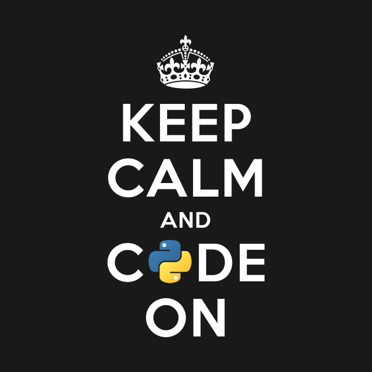

## Controversial PEPs You've (Probably) Never Heard Of
### (even if you're over 40)

Nick Coghlan (@ncoghlan_dev)

CPython core dev since 2005

Note:

- I get to make jokes about being over 40 now :)

---

### PEP (Acronym):  Python Enhancement Proposal

https://www.python.org/dev/peps/

Note:

* Python Enhancement Proposal
* Process for handling Python language and ecosystem change proposals that are
  too complex or controversial to be handled as a regular tracker issue on
  bugs.python.org
* All available online, as are the mailing lists themselves

---

## PEP 227: Statically Nested Scopes
### Available: Python 2.1
### Default: Python 2.2

    def outer(base=0):
        def inner(add):
            return base + add
        return inner

    # Previously not possible to reference "base" from "inner"

---

> This will break code... I'm not sure whether it's worth going
> down this path just for the sake of being able to define
> functions within functions.

(python-dev post, November 2000)

---

## PEP 318: Decorators for Functions and Methods
### Added: Python 2.4

    @classmethod
    def from_text(cls, input_text):
        args = cls._parse_text(input_text)
        return cls(*args)

    # Previously written as
    def from_text(cls, input_text):
        args = cls._parse_text(input_text)
        return cls(*args)
    from_text = classmethod(from_text)

---

> Two decorators (classmethod() and staticmethod()) have been available in
> Python since version 2.2. ... Discussions have raged off-and-on in
> both comp.lang.python and the python-dev mailing list about how best to
> implement function decorators.

(PEP 318 Background section)

Note:

- Lots of objections to the at symbol being intrusive and ugly
- Lots of objections to the fact that there was no obvious way to pronounce it
- Lots of objections to the fact that this was no longer executable pseudocode
- Now routinely accepted as a way of marking up callables and classes with
  extra information

---

## PEP 308: Conditional Expressions
### (Added: Python 2.4)

    result = arg if arg is not None else default

    # Previously written using the bug-prone form:
    result = arg is not None and arg or default

Note:

- Lots of objections about unduly encouraging more cryptic code
- Actually intended to wipe out use of the bug-prone and/or hack
- I suspect for anyone that learned Python in the past ten years, this may
  be the first time they've even seen the and/or hack referenced

---

## PEP 340: Anonymous Block Statements
### Proposed by Guido van Rossum
### Never shipped

    block EXPR1 as VAR1:
        BLOCK1

---

> Block statements provide a mechanism for encapsulating patterns of structure.
> Code inside the block statement runs under the control of an object called a
> block iterator. Simple block iterators execute code before and after the code
> inside the block statement. ...

(PEP 340 Motivation & Summary)

---

> ... Block iterators also have the opportunity to
> execute the controlled code more than once (or not at all), catch exceptions,
> or receive data from the body of the block statement.

(PEP 340 Motivation & Summary, continued)

---

* PEP 342: Coroutines via Enhanced Generators
* PEP 343: The "with" statement
* PEP 380: Delegating to subgenerators
* PEP 492: Coroutines with async and await syntax

Note:

- spawned send() and throw() methods on generators
- spawned the with statement and context managers
- helped lay the foundation for yield from, asyncio, and native coroutines

---

## PEP 465: Operator for matrix multiplication
### Added: Python 3.5

    # Mathematical notation
    S = (Hβ − r)ᵀ(HVHᵀ) − 1(Hβ − r)

    # Python 3.5+ notation
    S = (H @ β - r).T @ inv(H @ V @ H.T) @ (H @ β - r)

    # Actually a successor to two much older PEPs (211, 225)

Note:

- one of the best researched and written PEPs in Python's history
- holds the record for shortest time from being written to being accepted
  and implemented (8 days)
- would have been even shorter, except Guido told the submitters they could
  have right associativity if they wanted it, so they had to go discuss that
  question on the scientific Python mailing lists for a few days
- controversy was after the fact, as a lot of folks didn't realise how long
  the matrix multiplication discussion had been going on (since the 90's), nor
  the fact that we had a long established history of adding syntactic features
  for numerical computing that none of the builtin types supported (extended
  slicing in general, ellipsis for multidimensional slicing)

---

Note:

https://www.teepublic.com/t-shirt/1930670-keep-calm-and-code-on-for-python-developers

Note:

- we do know why folks like the language
- we also see how Python gets used, and where it falls down, across *all* the
  different usage domains
- controversy most frequent flares up when features targeted primarily at
  solving problems in one domain bleed across into other domains (e.g. as
  new syntax or builtins)
- I've skipped over some of the more recent controversies, but compare common
  views on type hinting today to some of the apocalyptic statements being made
  a few years ago

---

https://devguide.python.org/

`from __future__ import flipfloperator`?

---

https://devguide.python.org/

~~`from __future__ import flipfloperator`~~
